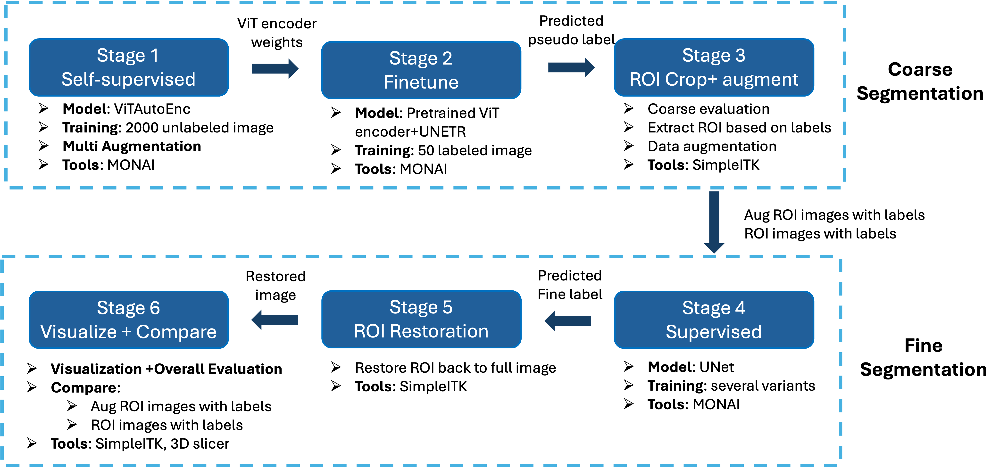

# **Semi-Supervised Abdominal Organ Segmentation: Harnessing Self-Supervised Learning and Pseudo-Labeling**

This repository provides the implementation of a coarse-to-fine segmentation framework for abdominal organ segmentation, as proposed in our CS 6357 course report: *"Semi-Supervised Abdominal Organ Segmentation: Harnessing Self-Supervised Learning and Pseudo-Labeling."* The framework consists of six stages, as illustrated below:



---

## **1. Environments and Requirements**
### **1.1 Clone the Repository**

```bash
git clone https://github.com/29xuan/abdomenSeg.git
cd abdomenSeg
pip install -r requirements.txt
```

### **1.2 Install Dependencies**
The implementation requires the installation of [MONAI](https://monai.io/) and [SimpleITK](https://simpleitk.readthedocs.io/). For detailed setup instructions, please refer to their official documentation.

---

## **2. Data Preparation**
### **2.1 Download Dataset**
The dataset is from the **MICCAI 2022 FLARE Challenge**. Please visit the [official website](https://flare22.grand-challenge.org/Dataset/) to download the dataset. After downloading, extract the files and organize the data and code according to the structure outlined in **2.2**.

### **2.2 Directory Structure**
```
abdomenSeg
  ├── stage_one_two
  ├── stage_three
  ├── stage_four
  ├── stage_five_six
FLARE
  ├── outputs_self
      └── best_model.pth
  ├── outputs_tuning
      └── best_metric_model.pth
  ├── Training
      ├── FLARE22_LabeledCase
      ├── FLARE22_UnLabeledCase
  ├── Tuning
      ├── images
      ├── labels
  ├── Testing
```

### **2.3 Model Weights**
Pretrained model weights can be downloaded from [Google Drive - Coarse Segmentation weigths](https://drive.google.com/drive/folders/16FQWFf4sDCXdyOZbKP8MR_43QlFS56-q?usp=drive_link) and [Google Drive-fine segmentation weights](https://drive.google.com/drive/folders/1KnrFWeXpBEyIIts_SGTKWrrMWyLhopb-?usp=drive_link). Place the downloaded weights in the corresponding directories as shown above.


---

## **3. Coarse Segmentation**
### **3.1 Stage One - Self-Supervised Learning**
Train a modified Vision Transformer (ViT) using all unlabeled data with contrastive and reconstruction tasks.

```bash
cd abdomenSeg/stage_one_two/src/
python self_supervised_pretrain.py
```

### **3.2 Stage Two - Fine-Tuning**
Fine-tune the pretrained ViT encoder combined with the UNETR decoder on labeled data.

```bash
cd abdomenSeg/stage_one_two/src/
python finetune.py
```

### **3.3 Stage Three - ROI Cropping and Data Augmentation**
Generate pseudo-labels using the UNETR model weights from stage two:

```bash
cd abdomenSeg/stage_three/src/
python generate_pseudo_labels.py
```

Extract Regions of Interest (ROIs) and apply data augmentation techniques (contrast enhancement, histogram equalization, Gaussian blur, gamma correction):
```bash
python extract_roi.py
```

Evaluate the coarse segmentation metrics:
```bash
python metrics.py
python format_metrics.py
```

---

## **4. Fine Segmentation**
(Provide instructions for fine segmentation here, including the steps for supervised training, ROI restoration, and evaluation.)

Supervised training:
(1) Ori: training on the original data
```bash
python unet_train.py --flag='label'
```
(2) Aug: training on the augmented images
```bash
python unet_train.py --flag='label'
```
(3.1) Pseudo: use pseudo labels for training and adjust the number of pseufo labels (the current options includes pseduo25/pseduo50/pseduo100 and can be easily adjusted for other numbers)
```bash
python unet_train.py --flag='pseduo25'
```
(3.2) Pseudo: use pseudo labels for training and adjust the ratio in the weight of loss function
```bash
python unet_train_pseudo.py --flag='pseduo' --weight=0.2
```

Inference: 
This first conduct inference on the ROI image and restore the ROI into the original images, the images will be saved.

```bash
python unet_inference.py --flag='label'
python unet_inference.py --flag='aug'
python unet_inference.py --flag='pseduo25'
python unet_inference.py --flag='pseudo' --weight=0.2
```

Evaluate the fine segmentation metrics:
```bash
python unet_evaluate.py --flag='label'
python unet_evaluate.py --flag='aug'
python unet_evaluate.py --flag='pseduo25'
python unet_evaluate.py --flag='pseudo' --weight=0.2
```

---

## **5. Reference**
[1] Tang, Yucheng, Dong Yang, Wenqi Li, Holger R. Roth, Bennett Landman, Daguang Xu, Vishwesh Nath, and Ali Hatamizadeh. "Self-supervised pre-training of swin transformers for 3d medical image analysis." In Proceedings of the IEEE/CVF Conference on Computer Vision and Pattern Recognition, pp. 20730-20740. 2022.

[2] Hatamizadeh, Ali, Yucheng Tang, Vishwesh Nath, Dong Yang, Andriy Myronenko, Bennett Landman, Holger R. Roth, and Daguang Xu. "Unetr: Transformers for 3d medical image segmentation." In *Proceedings of the IEEE/CVF winter conference on applications of computer vision*, pp. 574-584. 2022.

[3] Chen, Liang, Paul Bentley, Kensaku Mori, Kazunari Misawa, Michitaka Fujiwara, and Daniel Rueckert. "Self-supervised learning for medical image analysis using image context restoration." *Medical image analysis* 58 (2019): 101539.

[4] Ma, Jun, and Bo Wang, eds. *Fast and Low-Resource Semi-supervised Abdominal Organ Segmentation: MICCAI 2022 Challenge, FLARE 2022, Held in Conjunction with MICCAI 2022, Singapore, September 22, 2022, Proceedings*. Vol. 13816. Springer Nature, 2023.

[5] MICCAI FLARE 2022: https://flare22.grand-challenge.org/

[6] UNet MONAI tutorial: https://github.com/Project-MONAI/tutorials/tree/main/3d_segmentation/torch


---
